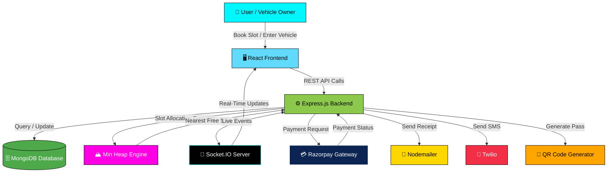
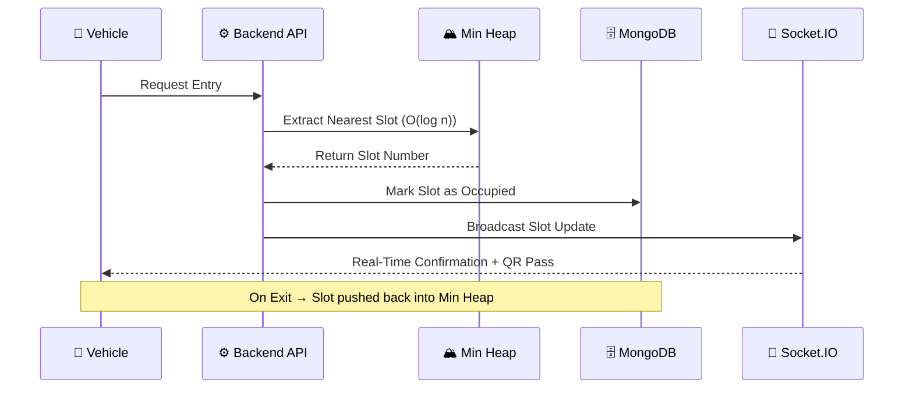

<div align="center">


### 🅿️ Intelligent. Automated. Real-Time. Parking, reimagined.

A full-stack **Smart Parking Management System** built on the **MERN Stack**, powered by a **Min Heap (Priority Queue)** for lightning-fast slot allocation — with QR passes, live dashboards, and secure payments baked in.

<br/>


</div>

---

## 📖 Table of Contents

- [About the Project](#-about-the-project)
- [Features](#-features)
- [Data Structures Used](#-data-structures-used)
- [Tech Stack](#-tech-stack)
- [System Architecture](#-system-architecture)
- [Folder Structure](#-folder-structure)
- [Installation & Setup](#-installation--setup)
- [Environment Variables](#-environment-variables)
- [API Overview](#-api-overview)
- [Screenshots](#-screenshots)
- [Roadmap](#-roadmap)
- [Contributing](#-contributing)
- [Author](#-author)
- [License](#-license)

---

## 🌟 About the Project

Parking chaos ends here. 🚫🚗💨

The **Smart Parking Management System** brings algorithmic intelligence to everyday parking — automatically finding and assigning the **nearest available slot** using a **Min Heap**, tracking every vehicle in **real time** with **Socket.IO**, and handling payments securely through **Razorpay**. Built for **malls, offices, airports, and smart cities**, this system is designed to be fast, fair, and effortlessly scalable.

> 💡 *"Efficient parking isn't just about space — it's about smart decisions made in milliseconds."*

---

## 🚀 Features

### 🚗 Parking Management
- ⚡ Automatic slot allocation using **Min Heap**
- 📡 Real-time parking slot availability
- 🚦 Vehicle entry & exit management
- 💰 Automatic parking fee calculation

### 📅 Slot Booking
- 🏢 Book parking slots by **floor and zone**
- 🚫 Prevent duplicate bookings
- 📱 **QR pass generation** for every booking

### 💳 Payment Integration
- 🔐 **Razorpay** payment gateway
- 🎟️ Parking fee & booking payments
- ✅ Payment verification system

### 📊 Dashboard & Reports
- 📈 Live parking statistics
- 🧮 Parking utilization charts (Chart.js)
- 🚙 Vehicle records tracking
- 🗓️ Monthly parking reports

### 🔐 Authentication
Role-based login system:
- 👑 Super Admin
- 🛡️ Admin
- 👷 Staff

### 📡 Real-Time Updates
Powered by **Socket.IO**
- 🔄 Live parking updates across the system
- ⚡ Instant slot status changes

### 📩 Notifications
- 📧 Email receipts via **Nodemailer**
- 📱 SMS receipts via **Twilio**

---

## 🧠 Data Structures Used

### 🏔️ Min Heap (Priority Queue)

The heart of the system's efficiency — used to allocate the **nearest, most optimal slot** in near-instant time.

**Algorithm:**
1. Store all free slots in a **Min Heap**
2. Extract the **smallest slot number** when a vehicle enters
3. Mark the slot as **occupied**
4. On vehicle exit, **insert the slot back** into the heap

### ⏱️ Time Complexity

| Operation | Complexity | Description |
|-----------|:----------:|--------------|
| ➕ Insert Slot | `O(log n)` | Add a freed slot back to the heap |
| ➖ Remove Slot | `O(log n)` | Allocate nearest free slot |
| 🎯 Get Nearest Slot | `O(1)` | Peek the top of the heap |

---

## 🛠 Tech Stack

<div align="center">

| Layer | Technology |
|-------|------------|
| 🎨 **Frontend** | React · JavaScript · CSS · Chart.js |
| ⚙️ **Backend** | Node.js · Express.js |
| 🗄️ **Database** | MongoDB |
| 📡 **Real-Time** | Socket.IO |
| 💳 **Payments** | Razorpay |
| ✉️ **Notifications** | Nodemailer · Twilio |

</div>

---

## 🏗 System Architecture



### 🔄 Slot Allocation Flow



### 🖼️ Reference Architecture Diagram

<p align="center">

</p>

---

## 📁 Folder Structure

```
smart-parking-system/
├── client/                 # React frontend
│   ├── src/
│   │   ├── components/
│   │   ├── pages/
│   │   ├── context/
│   │   └── App.js
├── server/                  # Node + Express backend
│   ├── controllers/
│   ├── models/
│   ├── routes/
│   ├── utils/
│   │   └── minHeap.js       # Core slot-allocation algorithm
│   ├── sockets/
│   └── server.js
├── .env.example
├── package.json
└── README.md
```

---

## ⚙️ Installation & Setup

```bash
# 1️⃣ Clone the repository
git clone https://github.com/biswajitpattanaik/smart-parking-system.git
cd smart-parking-system

# 2️⃣ Install backend dependencies
cd server
npm install

# 3️⃣ Install frontend dependencies
cd ../client
npm install

# 4️⃣ Run the backend
cd ../server
npm start

# 5️⃣ Run the frontend
cd ../client
npm start
```

---

## 🔑 Environment Variables

Create a `.env` file inside the `server/` directory:

```env
PORT=5000
MONGO_URI=your_mongodb_connection_string
JWT_SECRET=your_jwt_secret
RAZORPAY_KEY_ID=your_razorpay_key
RAZORPAY_KEY_SECRET=your_razorpay_secret
EMAIL_USER=your_email
EMAIL_PASS=your_email_password
TWILIO_SID=your_twilio_sid
TWILIO_AUTH_TOKEN=your_twilio_token
```

---

## 📡 API Overview

| Method | Endpoint | Description |
|--------|----------|-------------|
| `POST` | `/api/auth/login` | User / Admin / Staff login |
| `POST` | `/api/vehicle/entry` | Log vehicle entry & allocate slot |
| `POST` | `/api/vehicle/exit` | Log vehicle exit & release slot |
| `POST` | `/api/booking/book` | Book a slot by floor/zone |
| `GET`  | `/api/slots/status` | Get real-time slot availability |
| `POST` | `/api/payment/create` | Create Razorpay payment order |
| `POST` | `/api/payment/verify` | Verify payment signature |
| `GET`  | `/api/reports/monthly` | Fetch monthly parking report |

---

## 📸 Screenshots

> _Add your dashboard, booking screen, and QR pass screenshots here to bring the project to life!_

---

## 🗺️ Roadmap

- [ ] 🅿️ Multi-city parking network support
- [ ] 🤖 AI-based demand prediction for pricing
- [ ] 📍 GPS-based nearest parking suggestion
- [ ] 🌙 Dark mode for dashboard
- [ ] 📱 Native mobile app (React Native)

---

## 🤝 Contributing

Contributions, issues, and feature requests are always welcome! 🙌

1. Fork the project
2. Create your feature branch (`git checkout -b feature/AmazingFeature`)
3. Commit your changes (`git commit -m 'Add some AmazingFeature'`)
4. Push to the branch (`git push origin feature/AmazingFeature`)
5. Open a Pull Request

---

## 👨‍💻 Author

<div align="center">

### ✨ Maintained & Created by **Biswajit Pattanaik** ✨

*"Great systems aren't just built — they're engineered with purpose, precision, and passion."* 🚀

Built with 💙 logic, 🧠 data structures, and a relentless drive to solve real-world problems, one smart slot at a time.

[](https://github.com/biswajitpattanaik)
[](#)
[](#)

</div>

---

## 📜 License

This project is licensed under the **MIT License** — free to use, modify, and distribute with attribution.

---

<div align="center">

### 🌟 If you found this project useful, don't forget to give it a **star**! 🌟


</div>
